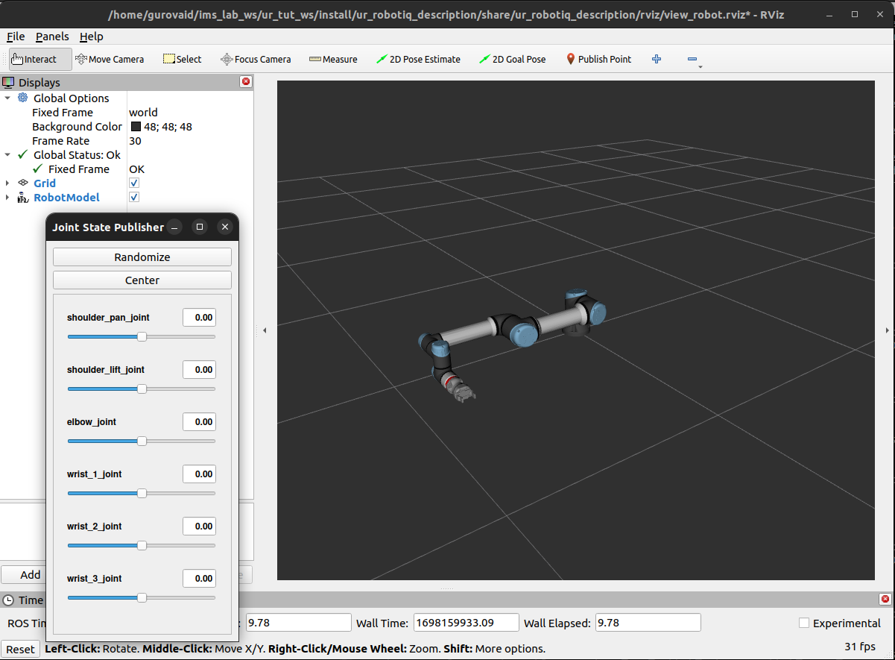
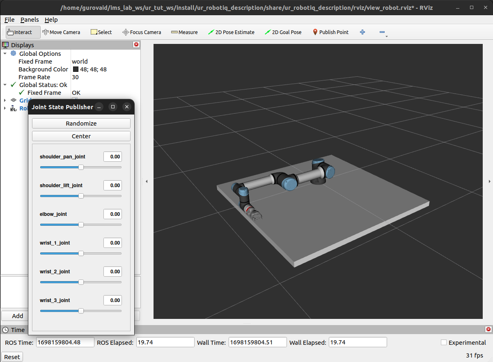

# UR With Robotiq Hand-e Tutorial

This is a guide on how to create a custom Moveit configuration using Moveit Setup Assistant. Before starting the tutorial you should first install all of the necessary stuff from the Prerequisites section.

## Instructions:
* [Setup Connection with UR5e](#setup-connection-with-ur5e)
* [Create Custom Moveit Config](#create-custom-moveit-config)
* [Running A Sample Code](#running-a-sample-code)
* [Controlling Robotiq Gripper](#controlling-robotiq-gripper)

## Prerequisites
 * [Moveit](https://moveit.ros.org/install-moveit2/binary/)
 * [Universal Robots ROS2 Driver](https://github.com/UniversalRobots/Universal_Robots_ROS2_Driver)

### Clone this workspace and build
```bash
cd
mkdir -p colcon_ws/src
cd ~/colcon_ws/src
git clone --recurse-submodules https://github.com/patsyuk03/URWithRobotiqTutorial.git
cd ~/colcon_ws
colcon build --packages-select gripper_srv
source install/setup.bash
colcon build
source install/setup.bash
```
This repository contains ROS2 driver and description for Robotiq Hand-e, additionally, it has a demo package that includes one demo that you can run with fake hardware and the demo for the real robot execution with Robotiq gripper and custom moveit config.

## **Setup Connection with UR5e** 
### 1. Setup network connection
<br>

### 2. Launch UR5e controller and moveit config
Note: source the workspace every time you open the new terminal.
```bash
cd ~/colcon_ws
source install/setup.bash
```
<br>**For work with fake hardware:**

In one terminal:
```bash
ros2 launch ur_robot_driver ur_control.launch.py ur_type:=ur5e robot_ip:=xxx.xxx.x.xxx use_fake_hardware:=true initial_joint_controller:=joint_trajectory_controller launch_rviz:=false
```
In another terminal:
```bash
ros2 launch ur_moveit_config ur_moveit.launch.py ur_type:=ur5e use_fake_hardware:=true launch_rviz:=true
```
<br>**For work with real robot:**

In one terminal:
```bash
ros2 launch ur_robot_driver ur_control.launch.py ur_type:=ur5e robot_ip:=xxx.xxx.x.xxx use_fake_hardware:=false launch_rviz:=false initial_joint_controller:=scaled_joint_trajectory_controller
```
In another terminal:
```bash
ros2 launch ur_moveit_config ur_moveit.launch.py ur_type:=ur5e use_fake_hardware:=false launch_rviz:=true
```
### 3. If working with real robot start external_control program at teach pendant

## **Create Custom Moveit Config** 

In the previous step, we used the default moveit configuration which has only a robot with no gripper or table that it stands on. In this section, you will learn how to create a custom Moveit configuration using Moveit Setup Assistant.

### 1. Add table

First lets see the robot description that we have now:

```bash
ros2 launch ur_robotiq_description view_robot.launch.py
```

<br>


This robot description file does not have the table, in this case, there is always a chance that the robot will collide with the table in the real world. To avoid this we can add the table to the robot description. To do this open file _ur5e_with_robotiq_hande.xacro_ from the _ur_robotiq_description_ package and add there the following code:

```bash
  <!-- Add table link -->
  <link name="table">
    <visual>
      <geometry>
        <box size="1.5 1.5 0.05"/>
      </geometry>
      <material name="white">
        <color rgba="1 1 1 1"/>
      </material>
    </visual>
    <collision>
      <geometry>
        <box size="1.5 1.5 0.05"/>
      </geometry>
    </collision>
  </link>

  <!-- Define table position relative to the world link -->
  <joint name="world_to_table" type="fixed">
    <parent link="world"/>
    <child link="table"/>
    <origin xyz="0 0 -0.15" rpy="0 0 0"/>
  </joint>
```

Build the workspace with added changes:

```bash
cd ~/colcon_ws
colcon build
```
Check that the table was added successfully:

```bash
ros2 launch ur_robotiq_description view_robot.launch.py
```

<br>


### 2. Moveit Setup Assistant

```bash
ros2 run moveit_setup_assistant moveit_setup_assistant
```
First, select "Create New MoveIt Configuration Package" and browse the ur5e_with_robotiq_hande.xacro robot description from ur_robotiq_description package.
<br><br>
Then select "Load Files".
<br><br>
From the left bar choose "Self-Collisions" and press "Generate Collision Matrix". This step creates the collision matrix that lets the robot know of the possible collisions with itself, the gripper, or the table.
<br><br>
From the left bar select "Planning Groups" and press "Add Group". Write the Group Name, select Kinematic Solver and Group Default Planner. Press "Add Kin. Chain". 
<br><br>
Choose the "Base Link" and the "Tip Link" from the robot links. In this case base_link and tool0.
<br><br>
The end result should look like this:
<br><br>
From the left bar select "Robot Poses" and click "Add Robot Pose". Choose the name for the pose and by dragging the trackbars create the desired pose.
<br><br>
Next, we need to add the controllers. Select "ROS2 Controllers" -> "Add Controller", and enter the name of the controller. Press "Add Planning Group Joints".
<br><br>
Select "ur_manipulator" group and click "Save".
<br><br>
This should be the result:
<br><br>
Now do the same thing for "Moveit Controllers" but instead of _JointTrajectoryController_ keep the default _FollowTrajectoryController_.
<br><br>
Add the author's information.
<br><br>
Finally, select "Configuration Files" from the left bar, click Browse, and select "URWithRobotiqTutorial" as the directory where to save the newly created MoveIt configuration package then add "/ur_robotiq_moveit_config". Press "Generate Package".
<br><br>

### 3. Modify generated package

1. Open file _ur5e_with_robotiq_hande.urdf.xacro_ in _ur_robotiq_moveit_config_ package in _config_ folder and change initial_positions_file->initial_positions. The final content of the file should be the following:

<br>

2. Open file _ros2_controllers.yaml_ in _ur_robotiq_moveit_config_ package and delete those lines:

```bash
joint_state_broadcaster:
      type: joint_state_broadcaster/JointStateBroadcaster
```

3. Save the files

### 4. See the result

```bash
cd ~/colcon_ws
colcon build
source install/setup.bash 
ros2 launch ur_robotiq_moveit_config demo.launch.py
```
<br>

## **Running A Sample Code**
### 1. Launch PnP demo
<br>**For work with fake hardware:** 

In one terminal:
```bash
ros2 launch ur_robotiq_demo ur_with_gripper_demo.launch.py use_fake_hardware:=true
```
In another terminal:
```bash
ros2 run ur_robotiq_demo demo
```
<br>**For work with real robot:**

In one terminal:
```bash
ros2 launch ur_robotiq_demo ur_with_gripper_demo.launch.py robot_ip:=xxx.xxx.x.xxx use_fake_hardware:=false
```
Start external_control program at teach pendant
In another terminal:
```bash
ros2 run ur_robotiq_demo ur_with_gripper_demo
```
## **Controlling Robotiq Gripper**

### 1. Setup network connection
Same as in [Setup Connection with UR5e](#setup-connection-with-ur5e)

### 2. Launch gripper driver

In one terminal:
```bash
ros2 launch robotiq_hande_ros2_driver gripper_bringup.launch.py robot_ip:=xxx.xxx.x.xxx
```
In another terminal:
### 3. Run the test
```bash
ros2 run robotiq_hande_ros2_driver test 
```
